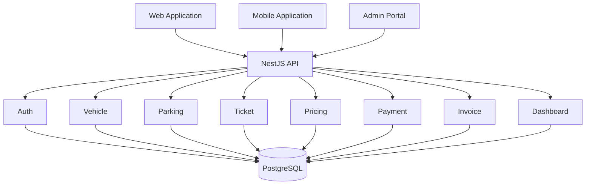
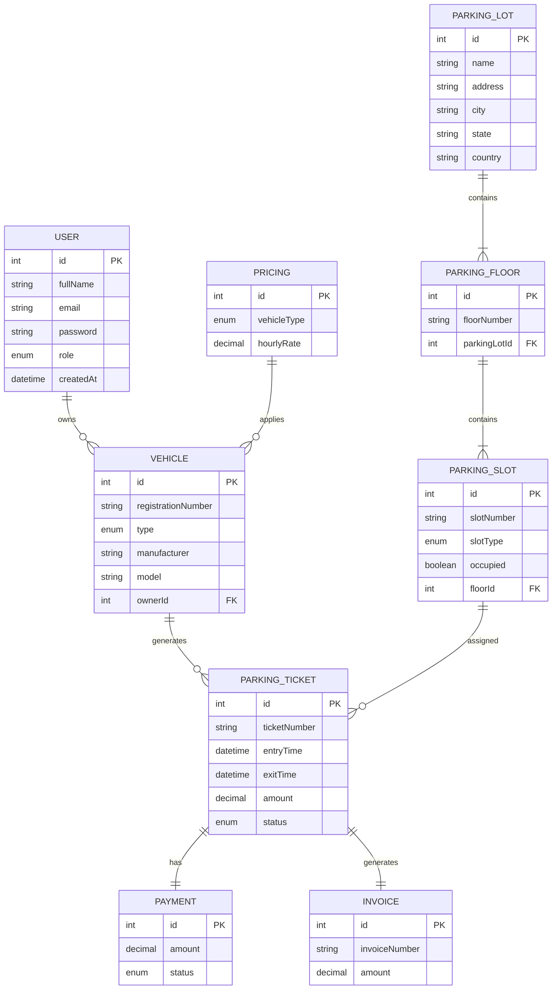
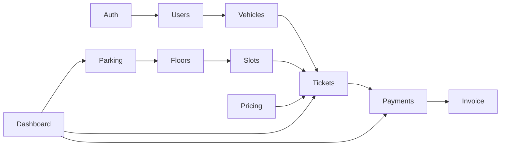
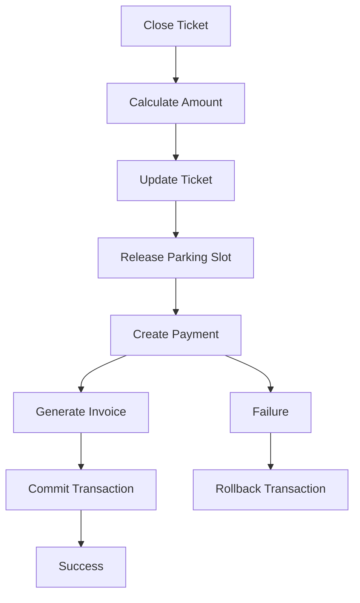
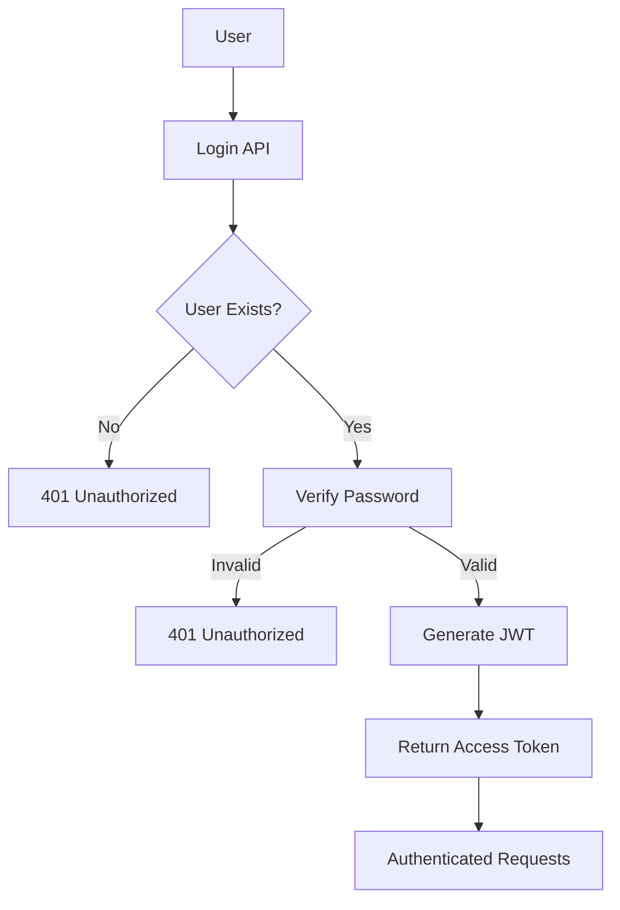
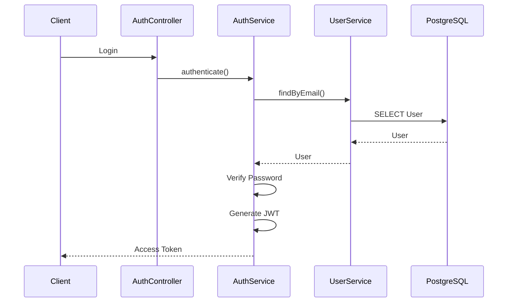
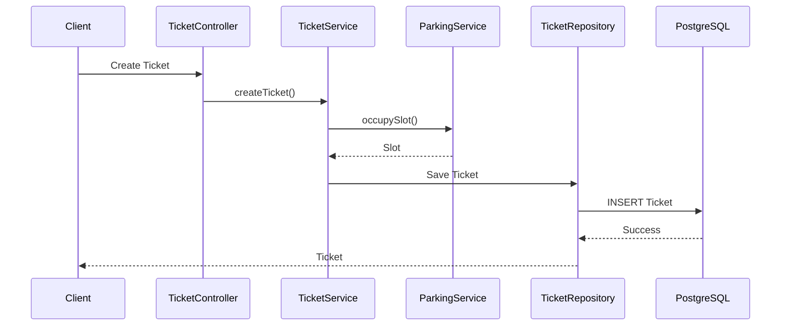
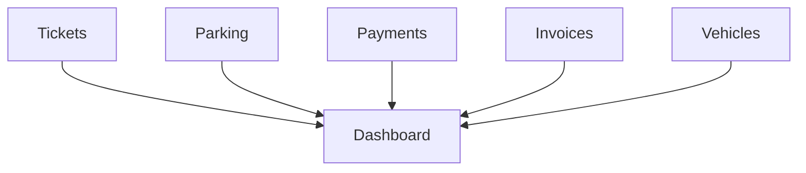
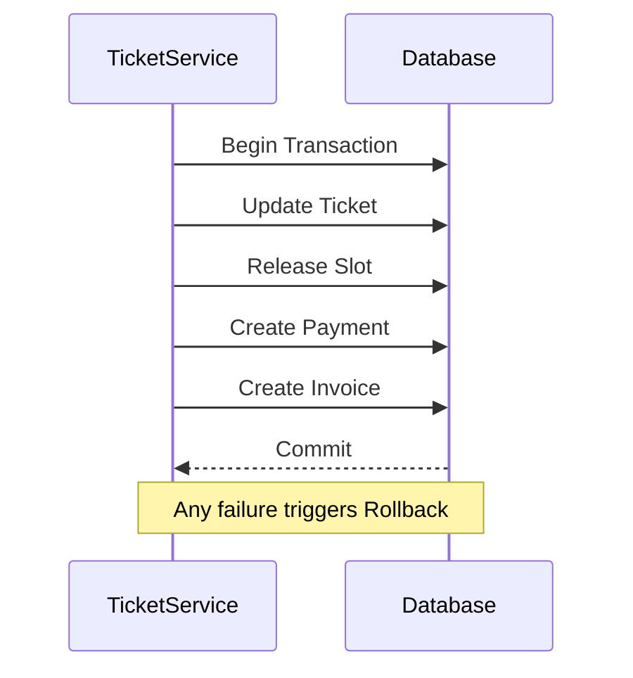
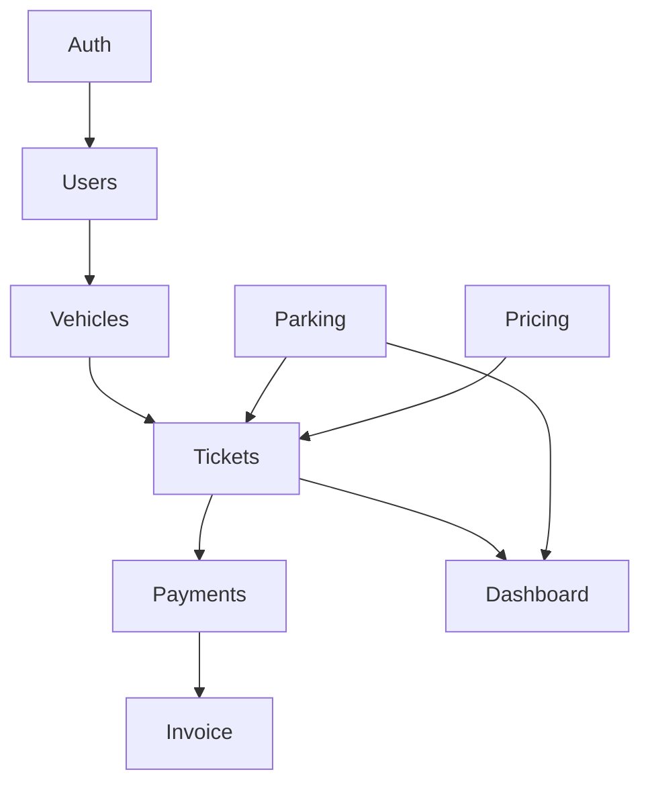

<div align="center">

# 🚗 Parking Management System

### Enterprise Parking Management Backend built with NestJS, GraphQL & PostgreSQL


A production-ready Parking Management Backend demonstrating modern backend architecture using **NestJS**, **REST APIs**, **GraphQL**, **JWT Authentication**, **Role Based Authorization**, **TypeORM**, and **PostgreSQL**.

</div>

---

# 📖 Table of Contents

- Overview
- Features
- Tech Stack
- System Architecture
- High Level Architecture Diagram
- Key Modules
- Project Structure
- Database Schema
- Authentication
- Parking Flow
- Ticket Flow
- Payment Flow
- Invoice Flow
- REST APIs
- GraphQL APIs
- Swagger
- Installation
- Docker
- Testing
- CI/CD
- Future Improvements

---

# 📌 Overview

Managing large parking facilities such as malls, airports, hospitals, offices and smart cities requires a scalable backend capable of handling thousands of vehicles, parking slots and payments efficiently.

This project demonstrates how an enterprise backend can be designed using NestJS following clean architecture principles.

The application supports

- User Authentication
- Role Based Authorization
- Parking Lots
- Parking Floors
- Parking Slots
- Vehicle Management
- Ticket Generation
- Dynamic Pricing
- Payments
- Invoice Generation
- Dashboard APIs
- REST APIs
- GraphQL APIs

The project is designed with modular architecture where every business capability is isolated inside its own NestJS module.

---

# ✨ Features

## Authentication

- User Registration
- Login
- JWT Authentication
- Password Hashing (bcrypt)
- Access Token
- Refresh Token
- Role Based Authorization

---

## Parking Management

- Create Parking Lots
- Update Parking Lots
- Delete Parking Lots
- Parking Floors
- Parking Slots
- Occupancy Management
- Slot Availability
- Slot Allocation
- Slot Release

---

## Vehicle Management

- Register Vehicle
- Update Vehicle
- Delete Vehicle
- Search Vehicle
- Vehicle History

---

## Ticket Management

- Generate Parking Ticket
- Entry Time
- Exit Time
- Active Ticket
- Ticket History
- Parking Duration

---

## Pricing

- Hourly Pricing
- Vehicle Type Pricing
- Dynamic Price Calculation

---

## Payment

- Payment Processing
- Payment History
- Payment Status

---

## Invoice

- Invoice Generation
- Invoice History

---

## Dashboard

- Total Vehicles
- Active Tickets
- Parking Occupancy
- Revenue
- Available Slots

---

## APIs

- REST APIs
- GraphQL APIs
- Swagger Documentation

---

# 🛠 Tech Stack

| Layer          | Technology      |
| -------------- | --------------- |
| Language       | TypeScript      |
| Backend        | NestJS          |
| Database       | PostgreSQL      |
| ORM            | TypeORM         |
| API            | REST + GraphQL  |
| Authentication | JWT             |
| Validation     | class-validator |
| Documentation  | Swagger         |
| Testing        | Jest            |
| Container      | Docker          |
| CI/CD          | GitHub Actions  |

---

# 🏗 High Level Architecture

```text
                    Client Applications

        Web App          Mobile App          Admin Portal

                     REST / GraphQL

                            │

                    NestJS Application

────────────────────────────────────────────────────────────

 Authentication Module

 Vehicle Module

 Parking Module

 Ticket Module

 Pricing Module

 Payment Module

 Invoice Module

 Dashboard Module

────────────────────────────────────────────────────────────

        Service Layer (Business Logic)

────────────────────────────────────────────────────────────

      Repository Layer (TypeORM)

────────────────────────────────────────────────────────────

             PostgreSQL Database
```

---

# 📐 System Architecture Diagram



---

# 🧩 Application Architecture

```text
Presentation Layer

REST Controllers
GraphQL Resolvers

↓

Business Layer

Services

↓

Repository Layer

Repositories

↓

Persistence Layer

PostgreSQL Database
```

---

# 🏛 Clean Architecture

```text
                 Client

                    │

REST Controller / GraphQL Resolver

                    │

               Service Layer

                    │

             Repository Layer

                    │

               PostgreSQL
```

---

# 📦 Major Modules

```
Authentication

Users

Vehicles

Parking

Pricing

Tickets

Payments

Invoices

Dashboard
```

---

# 🚀 Project Highlights

✅ REST API

✅ GraphQL

✅ JWT Authentication

✅ Role Based Authorization

✅ Repository Pattern

✅ Service Layer

✅ PostgreSQL

✅ TypeORM

✅ Validation

✅ Swagger

✅ Docker

✅ Global Exception Handling

✅ Logging

✅ Transactions

✅ Pagination

✅ Filtering

✅ Search

✅ Dashboard APIs

---

# 📁 Project Structure

```text
src

├── common
│   ├── decorators
│   ├── guards
│   ├── filters
│   ├── interceptors
│   ├── dto
│   ├── constants
│   └── utils
│
├── config
│
├── database
│   ├── migrations
│   └── seed.ts
│
├── modules
│   ├── auth
│   ├── users
│   ├── parking
│   ├── vehicles
│   ├── pricing
│   ├── ticket
│   ├── payment
│   ├── invoice
│   ├── dashboard
│   └── health
│
├── app.module.ts
└── main.ts
```

---

# 📊 Project Statistics

| Metric         | Value          |
| -------------- | -------------- |
| Architecture   | Modular        |
| Database       | PostgreSQL     |
| ORM            | TypeORM        |
| Authentication | JWT            |
| Authorization  | RBAC           |
| APIs           | REST + GraphQL |
| Documentation  | Swagger        |
| Language       | TypeScript     |
| Framework      | NestJS         |
| Container      | Docker         |

---

# 🗄 Database Design

The Parking Management System follows a **relational database design** using **PostgreSQL** and **TypeORM**.

The application is normalized to minimize redundancy while maintaining efficient querying for parking operations.

---

# 📊 Entity Relationship Diagram (ERD)



---

# 📌 Database Relationships

## User → Vehicle

One user can own multiple vehicles.

```text
User

↓

Vehicle

↓

Vehicle

↓

Vehicle
```

Relationship

```
One To Many
```

---

## Parking Lot → Floor

One parking lot contains multiple floors.

```
Parking Lot

↓

Ground Floor

↓

First Floor

↓

Second Floor
```

---

## Floor → Slots

Each floor contains multiple parking slots.

```
Floor

↓

Slot A1

↓

Slot A2

↓

Slot A3
```

---

## Vehicle → Ticket

One vehicle can generate many tickets over time.

```
Vehicle

↓

Ticket

↓

Ticket

↓

Ticket
```

---

## Ticket → Payment

Each completed ticket generates one payment.

```
Ticket

↓

Payment
```

---

## Ticket → Invoice

Each payment generates an invoice.

```
Ticket

↓

Invoice
```

---

# 📊 Database Schema Overview

```text
USER

│

├── id

├── fullName

├── email

├── password

└── role

↓

VEHICLE

↓

PARKING TICKET

↓

PAYMENT

↓

INVOICE
```

---

# 📚 Entity Description

## User

Stores application users.

Fields

```
id

fullName

email

password

role

createdAt
```

---

## Vehicle

Stores all registered vehicles.

Fields

```
registrationNumber

manufacturer

model

vehicleType

owner
```

---

## Parking Lot

Represents a physical parking location.

```
Mall Parking

Airport Parking

Office Parking
```

---

## Parking Floor

Each parking lot can have multiple floors.

Example

```
Ground

First

Second

Third
```

---

## Parking Slot

Represents an individual parking space.

Example

```
A101

A102

A103
```

---

## Parking Ticket

Created when a vehicle enters the parking.

Contains

```
Entry Time

Exit Time

Status

Amount
```

---

## Pricing

Stores hourly pricing.

Example

| Vehicle |   Price |
| ------- | ------: |
| Bike    |  ₹20/hr |
| Car     |  ₹50/hr |
| SUV     |  ₹80/hr |
| Bus     | ₹150/hr |

---

## Payment

Stores payment information.

```
SUCCESS

FAILED

PENDING
```

---

## Invoice

Stores invoice generated after successful payment.

Contains

```
Invoice Number

Ticket

Amount

Date
```

---

# 🔗 Module Dependency Diagram



---

# 🏗 Dependency Flow

```text
Auth
 │
 ▼
Users
 │
 ▼
Vehicles
 │
 ▼
Tickets
 │
 ├─────────────► Pricing
 │
 ▼
Payments
 │
 ▼
Invoices
```

---

# 🧠 Design Decisions

### Why PostgreSQL?

- ACID compliant
- Excellent indexing
- Strong relational support
- Transactions
- JSON support
- Production ready

---

### Why TypeORM?

- Native NestJS integration
- Entity decorators
- Repository pattern
- Migrations
- Lazy/Eager relations

---

### Why Repository Pattern?

Repositories isolate persistence from business logic.

```text
Controller

↓

Service

↓

Repository

↓

Database
```

This improves:

- Maintainability
- Testability
- Separation of concerns

---

# 🔄 Transaction Flow

The `closeTicket()` operation executes multiple database updates that should succeed or fail together.



---

# 📈 Scalability Considerations

The schema is designed so that future features can be added with minimal changes.

Future enhancements include:

- Multi-city parking
- Multi-tenant architecture
- Dynamic pricing rules
- Reservation system
- Loyalty program
- QR Code entry/exit
- RFID integration
- Payment gateways (Stripe, Razorpay)
- Redis caching
- Kafka event streaming
- Microservices migration

---

# 🔄 Business Workflow

The Parking Management System follows a modular workflow where each module is responsible for a specific business capability.

---

# 🔐 Authentication Flow

Users must authenticate before accessing protected resources.



---

# 🔑 JWT Authentication Lifecycle



---

# 🚗 Vehicle Entry Flow

When a vehicle enters the parking lot.

```mermaid
flowchart TD

A[Vehicle Arrives]

↓

B[Vehicle Registered?]

↓

C[Find Available Slot]

↓

D[Mark Slot Occupied]

↓

E[Generate Ticket]

↓

F[Save Ticket]

↓

G[Entry Completed]
```

---

# 🎫 Ticket Generation Workflow



---

# 🚙 Vehicle Exit Flow

When the vehicle exits.

```mermaid
flowchart TD

A[Vehicle Exit]

↓

B[Find Active Ticket]

↓

C[Calculate Duration]

↓

D[Calculate Parking Fee]

↓

E[Update Ticket]

↓

F[Release Slot]

↓

G[Create Payment]

↓

H[Generate Invoice]

↓

I[Exit Completed]
```

---

# 💰 Payment Workflow

```mermaid
sequenceDiagram

participant Client

participant PaymentController

participant PaymentService

participant PaymentRepository

participant PostgreSQL

Client->>PaymentController: Pay

PaymentController->>PaymentService: createPayment()

PaymentService->>PaymentRepository: Save Payment

PaymentRepository->>PostgreSQL

PostgreSQL-->>PaymentRepository

PaymentRepository-->>Client
```

---

# 🧾 Invoice Workflow

```mermaid
flowchart TD

A[Payment Successful]

↓

B[Generate Invoice Number]

↓

C[Create Invoice]

↓

D[Save Invoice]

↓

E[Return Invoice]
```

---

# 🚗 Complete Parking Lifecycle

```mermaid
flowchart LR

Vehicle

-->

Parking Slot

-->

Parking Ticket

-->

Payment

-->

Invoice

-->

Exit
```

---

# 🏢 Parking Slot Allocation

```mermaid
flowchart TD

Vehicle

↓

Find Floor

↓

Find Available Slot

↓

Reserve Slot

↓

Update Slot Status

↓

Create Ticket
```

---

# 📊 Dashboard Flow



Dashboard calculates

- Revenue
- Occupancy
- Available Slots
- Active Tickets
- Today's Entries
- Today's Exits

---

# 🌐 REST Request Lifecycle

```mermaid
sequenceDiagram

participant Client

participant Controller

participant Service

participant Repository

participant PostgreSQL

Client->>Controller: HTTP Request

Controller->>Service

Service->>Repository

Repository->>PostgreSQL

PostgreSQL-->>Repository

Repository-->>Service

Service-->>Controller

Controller-->>Client
```

---

# ⚡ GraphQL Request Lifecycle

```mermaid
sequenceDiagram

participant Client

participant Resolver

participant Service

participant Repository

participant PostgreSQL

Client->>Resolver: GraphQL Query

Resolver->>Service

Service->>Repository

Repository->>PostgreSQL

PostgreSQL-->>Repository

Repository-->>Service

Service-->>Resolver

Resolver-->>Client
```

---

# 🏗 NestJS Request Lifecycle

```mermaid
flowchart TD

Request

↓

Middleware

↓

Guard

↓

Interceptor (Before)

↓

Pipe Validation

↓

Controller

↓

Service

↓

Repository

↓

Database

↓

Interceptor (After)

↓

Response
```

---

# 🛡 Authorization Flow

```mermaid
flowchart TD

Request

↓

JWT Guard

↓

Verify Token

↓

Roles Guard

↓

Has Permission?

--> No

Return 403

--> Yes

Continue Request
```

---

# 🔄 Transaction Flow

The `closeTicket()` operation is executed inside a database transaction.



---

# 📌 Module Communication



---

# 📈 End-to-End Request Flow

```text
Client
   │
   ▼
REST Controller / GraphQL Resolver
   │
   ▼
Validation Pipe
   │
   ▼
JWT Guard
   │
   ▼
Roles Guard
   │
   ▼
Service Layer
   │
   ▼
Repository Layer
   │
   ▼
PostgreSQL
   │
   ▼
Service
   │
   ▼
Response
```

---

# 🎯 Key Design Principles

- Separation of Concerns
- Repository Pattern
- Dependency Injection
- Modular Architecture
- SOLID Principles
- Transaction Management
- Stateless Authentication
- Layered Architecture
- DTO Validation
- Role-Based Authorization
- Reusable Business Logic
- Testable Services

---

# 🌐 REST API Documentation

The application exposes REST APIs for all major business modules.

Base URL

```
http://localhost:3000/api/v1
```

Authentication

```
Authorization: Bearer <JWT_TOKEN>
```

---

# 🔐 Authentication APIs

## Register User

```
POST /auth/signup
```

Request

```json
{
  "fullName": "John Doe",
  "email": "john@example.com",
  "password": "Password@123"
}
```

Response

```json
{
  "id": 1,
  "fullName": "John Doe",
  "email": "john@example.com"
}
```

---

## Login

```
POST /auth/login
```

Request

```json
{
  "email": "john@example.com",
  "password": "Password@123"
}
```

Response

```json
{
  "accessToken": "eyJhbGc...",
  "refreshToken": "eyJhbGc..."
}
```

---

# 🚗 Vehicle APIs

## Get All Vehicles

```
GET /vehicles
```

Supports

- Pagination
- Sorting
- Filtering
- Search

Example

```
GET /vehicles?page=1&limit=10
```

---

## Get Vehicle

```
GET /vehicles/1
```

---

## Register Vehicle

```
POST /vehicles
```

```json
{
  "registrationNumber": "UP32AB1234",
  "manufacturer": "Toyota",
  "model": "Innova",
  "type": "CAR"
}
```

---

## Update Vehicle

```
PATCH /vehicles/1
```

---

## Delete Vehicle

```
DELETE /vehicles/1
```

---

# 🏢 Parking APIs

## Parking Lots

```
GET /parking-lots
POST /parking-lots
PATCH /parking-lots/:id
DELETE /parking-lots/:id
```

---

## Parking Floors

```
GET /floors
POST /floors
PATCH /floors/:id
DELETE /floors/:id
```

---

## Parking Slots

```
GET /slots
POST /slots
PATCH /slots/:id
DELETE /slots/:id
```

---

# 🎫 Ticket APIs

## Generate Ticket

```
POST /tickets
```

```json
{
  "vehicleId": 10,
  "slotId": 4
}
```

---

## Close Ticket

```
PATCH /tickets/close
```

```json
{
  "ticketId": 10
}
```

---

## Active Tickets

```
GET /tickets/active
```

---

## Ticket History

```
GET /tickets/history
```

---

# 💰 Pricing APIs

```
GET /pricing
POST /pricing
PATCH /pricing/:id
DELETE /pricing/:id
```

---

# 💳 Payment APIs

```
GET /payments
GET /payments/:id
POST /payments
```

---

# 🧾 Invoice APIs

```
GET /invoices
GET /invoices/:id
GET /invoices/ticket/:ticketId
```

---

# 📊 Dashboard APIs

```
GET /dashboard
GET /dashboard/revenue
GET /dashboard/occupancy
```

---

# ⚡ GraphQL Endpoint

```
http://localhost:3000/graphql
```

---

# Example GraphQL Query

```graphql
query {
  vehicles {
    id

    registrationNumber

    manufacturer

    model

    type
  }
}
```

---

# GraphQL Mutation

```graphql
mutation {
  createVehicle(
    input: {
      registrationNumber: "UP32AB1234"
      manufacturer: "Toyota"
      model: "Fortuner"
      type: CAR
    }
  ) {
    id

    registrationNumber
  }
}
```

---

# 🔐 Login Mutation

```graphql
mutation {
  login(input: { email: "john@example.com", password: "Password@123" }) {
    accessToken

    refreshToken
  }
}
```

---

# 🚀 Swagger Documentation

After starting the application

```
http://localhost:3000/api/docs
```

Swagger includes

- Authentication APIs
- Vehicle APIs
- Parking APIs
- Ticket APIs
- Payment APIs
- Invoice APIs

---

# ⚙ Environment Variables

Create

```
.env
```

```env
DATABASE_HOST=localhost

DATABASE_PORT=5432

DATABASE_USERNAME=postgres

DATABASE_PASSWORD=postgres

DATABASE_NAME=parking_management

JWT_SECRET=super-secret

JWT_EXPIRES_IN=1d

PORT=3000
```

---

# 🚀 Installation

Clone repository

```bash
git clone https://github.com/yourusername/parking-management.git
```

Install dependencies

```bash
npm install
```

Run database

```bash
docker compose up postgres
```

Run migrations

```bash
npm run migration:run
```

Seed database

```bash
npm run seed
```

Start application

```bash
npm run start:dev
```

---

# 🐳 Docker

Build

```bash
docker compose build
```

Run

```bash
docker compose up
```

---

# 🧪 Testing

Run Unit Tests

```bash
npm test
```

Watch Mode

```bash
npm run test:watch
```

Coverage

```bash
npm run test:cov
```

E2E Tests

```bash
npm run test:e2e
```

---

# 📈 Performance Optimizations

- Database Indexing
- DTO Validation
- Pagination
- Transactions
- Connection Pooling
- Compression
- Helmet
- CORS
- Logging
- JWT Authentication
- Repository Pattern

---

# 🔒 Security

- JWT Authentication
- Role-Based Access Control
- Password Hashing (bcrypt)
- Validation Pipes
- Global Exception Filters
- Request Logging
- Environment Variable Validation
- SQL Injection Protection via TypeORM
- CORS Configuration
- Helmet Security Headers

---

# 🚀 Future Enhancements

- Redis Cache
- Kafka Integration
- RabbitMQ Events
- QR Code Based Entry
- RFID Support
- Online Slot Reservation
- Payment Gateway Integration (Stripe/Razorpay)
- Email Notifications
- SMS Notifications
- Push Notifications
- WebSocket Live Parking Updates
- Multi-Tenant Support
- Microservices Architecture
- Kubernetes Deployment
- Prometheus Metrics
- Grafana Dashboards
- OpenTelemetry Tracing

---

# 📚 Learning Outcomes

This project demonstrates practical experience with:

- NestJS Modules
- Controllers
- Services
- Repositories
- TypeORM
- PostgreSQL
- REST APIs
- GraphQL
- JWT Authentication
- Role-Based Authorization (RBAC)
- DTO Validation
- Global Exception Handling
- Transactions
- Swagger Documentation
- Docker
- CI/CD
- Testing
- Clean Architecture
- SOLID Principles

---

# 🤝 Contributing

Contributions are welcome.

1. Fork the repository.
2. Create a feature branch.
3. Commit your changes.
4. Push to your branch.
5. Open a Pull Request.

---

# 📄 License

This project is licensed under the MIT License.

---

# 👨‍💻 Author

**Bhupendra Singh**

Senior Software Developer

- React.js
- Next.js
- NestJS
- GraphQL
- TypeScript
- PostgreSQL
- System Design

---

<div align="center">

## ⭐ If you found this project helpful, please consider giving it a Star!

**Happy Coding! 🚀**

</div>
